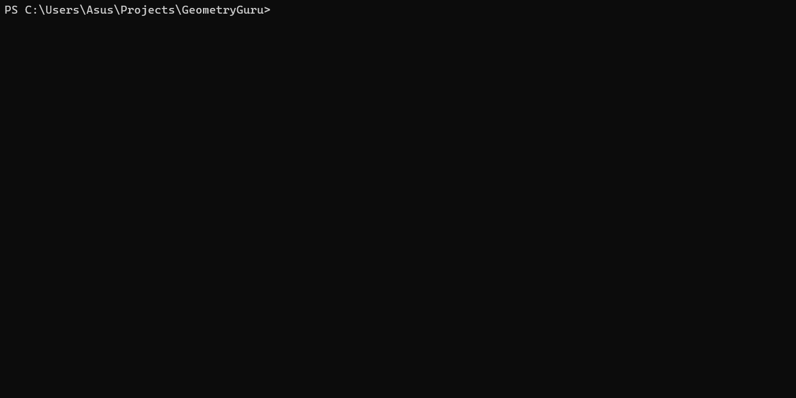

---

# 📐 Geometric Shape Area Calculator

This console application calculates the **surface area of different geometric shapes** using standard mathematical formulas. The program provides a user-friendly, menu-driven interface with colored console output for better readability.

## 🎬 Demo




## 🚀 Features

The application can calculate the area of the following shapes:

1. **Triangle**
   - Uses **Heron’s formula**
   - Validates whether a triangle with given sides exists

2. **Rectangle**
   - Formula: `Area = Length × Width`

3. **Square**
   - Formula: `Area = side²`

4. **Circle**
   - Formula: `Area = π × r²`

```
The program displays a menu, allows the user to choose a shape, and then asks for the required measurements to compute the area.

## 🧮 Menu Example

1. Triangle
2. Rectangle
3. Square
4. Circle

Select shape number:
```

---

# 📂 Code Overview

The program uses **separate functions** for each shape.
Below are key parts of the code and explanations.

---

## ▶ Main Program Loop

```csharp
do
{
    ShowMenu();

    int option = SelectMenuOption(0, 5);

    switch (option)
    {
        case 1:
            HandleTriangle();
            break;
        case 2:
            HandRectangle();
            break;
        case 3:
            HandleSquare();
            break;
        case 4:
            HandleCircle();
            break;
    }
} while (AskToContinue());
```

### 📝 What It Does

* Displays the menu
* Accepts user input
* Validates selection
* Calls the correct function
* Repeats if input is invalid
* Asks user to continue or not

---

## 🔺 Triangle Area (Heron's Formula)

```csharp
void HandleTriangle()
{
    Console.ForegroundColor = ConsoleColor.Yellow;
    Console.WriteLine("\nTo find triangle area, we use Heron's formula: A = Math.Sqrt(p(p−a)(p−b)(p−c)), where p = (a + b + c) / 2");
    Console.WriteLine("Enter the sides of the triangle:");

    Console.Write("a = ");
    double a = Convert.ToDouble(Console.ReadLine());
    Console.Write("b = ");
    double b = Convert.ToDouble(Console.ReadLine());
    Console.Write("c = ");
    double c = Convert.ToDouble(Console.ReadLine());
    Console.ResetColor();

    if (!IsValidTriangle(a, b, c))
    {
        Console.ForegroundColor = ConsoleColor.Red;
        Console.WriteLine();
        Console.WriteLine("There is no such triangle. The sum of the lengths of any two sides must be greater than the length of the third side");
        Console.ResetColor();
        return;
    }

    double areaTriangle = CalculateTriangleArea(a, b, c);

    Console.ForegroundColor = ConsoleColor.Green;
    Console.WriteLine($"\nTriangle area = {areaTriangle}");
    Console.ResetColor();
}
```

### 📝 What It Does

* Explains Heron’s formula
* Reads 3 triangle sides
* Checks triangle inequality
* Computes area using Heron’s formula
* Prints area or error message

---

## ▭ Rectangle Area

```csharp
void HandRectangle()
{
    Console.ForegroundColor = ConsoleColor.Yellow;
    Console.WriteLine("\nFormula for Rectangle area: A = Length * Width");
    Console.WriteLine("Enter length and width of the rectangle.");

    Console.Write("Length = ");
    double length = Convert.ToDouble(Console.ReadLine());
    Console.Write("Width = ");
    double width = Convert.ToDouble(Console.ReadLine());
    Console.ResetColor();

    double areaRectangle = CalculateRectangleArea(length, width);

    Console.ForegroundColor = ConsoleColor.Green;
    Console.WriteLine($"\nRectangle area = {areaRectangle}");
    Console.ResetColor();
}
```

### 📝 What It Does

* Reads length & width
* Calculates and prints area using `CalculateRectangleArea()` method

---

## ▢ Square Area

```csharp
void HandleSquare()
{
    Console.ForegroundColor = ConsoleColor.Yellow;

    Console.WriteLine("\nFormula for Square area: A = side * side");

    Console.Write("Enter side of the square: side = ");
    double side = Convert.ToDouble(Console.ReadLine());
    Console.ResetColor();

    double areaSquare = CalculateSquareArea(side);

    Console.ForegroundColor = ConsoleColor.Green;
    Console.WriteLine($"\nSquare area = {areaSquare}");
    Console.ResetColor();

}
```

### 📝 What It Does

* Reads side length
* Calculates and prints area using `CalculateSquareArea()` method

---

## ⚪ Circle Area

```csharp
void HandleCircle()
{
    Console.ForegroundColor = ConsoleColor.Yellow;

    Console.WriteLine("\nFormula for Circle area: A = πr²");

    Console.Write("Enter radius of the circle: r = ");
    double radius = Convert.ToDouble(Console.ReadLine());
    Console.ResetColor();

    double areaCircle = CalculateCircleArea(radius);

    Console.ForegroundColor = ConsoleColor.Green;
    Console.WriteLine($"\nCircle area = {areaCircle}");
    Console.ResetColor();

}
```

### 📝 What It Does

* Reads radius
* Computes area using `CalculateCircleArea()` method

---

## IsValidTriangle()

```csharp
bool IsValidTriangle(double sideA, double sideB, double sideC)
{
    return sideA + sideB > sideC && sideA + sideC > sideB && sideB + sideC > sideA;
}
```

### 📝 What It Does
* Checks whether the sum of the lengths of any two sides of a triangle greater than the length of the third side
* Returns `true` or `false`

---

## CalculateArea() methods

```csharp
double CalculateTriangleArea(double a, double b, double c)
{
    double p = (a + b + c) / 2;

    return Math.Sqrt(p * (p - a) * (p - b) * (p - c));
}

double CalculateRectangleArea(double length, double width) => length * width;

double CalculateSquareArea(double side) => side * side;

double CalculateCircleArea(double radius) => Math.PI * radius * radius;
```
* Return area of chosen shapes

---

## 📌 Requirements

* .NET SDK
* C# compiler
* Console environment

---

## 🚀 Usage

Run the program:

```bash
dotnet run
```

Choose a shape and enter the requested values.

---